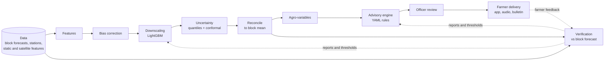

# GramDrishti

Panchayat-level weather forecasts and crop advisories, built from block-level forecasts.

> **All data in this repository is synthetic.** The district, Panchayats, stations, forecasts and observations in `data/` are artificial. Any accuracy number produced on them only shows that the code runs, not that the method works on real weather. See [data/README.md](data/README.md).

## The problem

Smart India Hackathon 2026, problem **SIH26074**: downscale block-level weather forecasts to Panchayat level for agro-meteorological advisory services.

Weather forecasts for farmers in India are usually issued per block, an area that can hold dozens of Panchayats. Within one block, rain can fall on one village and miss the next, irrigated land runs cooler than dry land, and low-lying fields get colder on winter nights. A single block number hides these differences, so advice such as "spray tomorrow" or "delay irrigation" can be wrong for many of the farmers who receive it.

## What GramDrishti does

1. Takes the block forecast from two weather model sources and corrects their known biases.
2. Downscales it to each Panchayat using local features (elevation, irrigation, soil, land cover, satellite data), with a range (10th, 50th and 90th percentile) instead of a single number.
3. Reconciles the Panchayat values so they always average back to the block forecast.
4. Derives farm variables: evapotranspiration, soil water balance, waterlogging, heat stress, frost risk.
5. Turns them into crop-stage advisories from transparent, expert-editable rules (no language model writes advice).
6. An agriculture officer reviews, edits and approves each advisory before it is sent.
7. Farmers receive approved advice in English, Hindi or Punjabi on a phone app that works offline, with audio and a printable bulletin.
8. A verification job measures, honestly, whether the Panchayat forecast beats the plain block forecast, including where it does not.

## Architecture



The verification loop compares forecasts with observations and farmer feedback. Its reports feed back into model and rule changes, made and reviewed by people.

## Repository layout

```
contract/   API contract: openapi.json, examples/*.json, CHANGELOG.md (shared)
data/       synthetic mock dataset and its generator
backend/    Python package `gramdrishti`: data, models, advisory engine, API
frontend/   React + TypeScript app: officer console and farmer app
docs/       guides, progress log, decisions, model card, demo script
scripts/    helper scripts
```

## Quick start

The backend data layer and baselines run (S1). The API (S2) and frontend (S3) do not exist yet.

```bash
# backend
cd backend
python -m venv .venv && source .venv/bin/activate
pip install -e ".[dev]"
python ../data/generate_mock_data.py            # recreates the git-ignored synthetic oracle
pytest -q && ruff check .
python -m gramdrishti.verify.baseline_report   # B0/B1/B2 scores on CALIB
uvicorn gramdrishti.api.main:app --reload --port 8000   # from S2

# frontend
cd frontend
npm ci
npm run dev                        # http://localhost:5173
```

## Status

| Area | Status |
|---|---|
| Repo foundation and CI | done (S0) |
| Backend data layer and baselines | PR open (S1) |
| API contract | not started |
| Frontend | not started |
| Models, advisories, verification | not started |

Full session-by-session log: [docs/PROGRESS.md](docs/PROGRESS.md).

## Contributing

See [CONTRIBUTING.md](CONTRIBUTING.md). Project rules for Claude Code sessions are in [CLAUDE.md](CLAUDE.md).

## Licence

[MIT](LICENSE).
