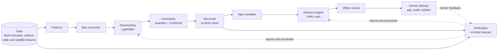

# GramDrishti

Panchayat-level weather forecasts and crop advisories, built from block-level forecasts.

> **All data in this repository is synthetic.** The district, Panchayats, stations, forecasts and observations in `data/` are artificial. Any accuracy number produced on them only shows that the code runs, not that the method works on real weather. See [data/README.md](data/README.md).

## The problem

Smart India Hackathon 2026, problem **SIH26074**: downscale block-level weather forecasts to Panchayat level for agro-meteorological advisory services.

Weather forecasts for farmers in India are usually issued per block, an area that can hold dozens of Panchayats. Within one block, rain can fall on one village and miss the next, irrigated land runs cooler than dry land, and low-lying fields get colder on winter nights. A single block number hides these differences, so advice such as "spray tomorrow" or "delay irrigation" can be wrong for many of the farmers who receive it.

## What GramDrishti does

1. Takes the block forecast from two weather model sources and corrects their known biases.
2. Downscales it to each Panchayat using local features (elevation, irrigation, soil, land cover, satellite data), with a range (10th, 50th and 90th percentile) instead of a single number.
3. Reconciles the Panchayat values so they always average back to the block forecast.
4. Derives farm variables: evapotranspiration, soil water balance, waterlogging, heat stress, frost risk.
5. Turns them into crop-stage advisories from transparent, expert-editable rules (no language model writes advice).
6. An agriculture officer reviews, edits and approves each advisory before it is sent.
7. Farmers receive approved advice in English, Hindi or Punjabi on a phone app that works offline, with audio and a printable bulletin.
8. A verification job measures, honestly, whether the Panchayat forecast beats the plain block forecast, including where it does not.

## Architecture


```mermaid
flowchart LR
    D[("Data<br/>block forecasts, stations,<br/>static and satellite features")] --> F[Features]
    F --> BC[Bias correction]
    BC --> DS[Downscaling<br/>LightGBM]
    DS --> U[Uncertainty<br/>quantiles + conformal]
    U --> R[Reconcile<br/>to block mean]
    R --> AV[Agro-variables]
    AV --> AE[Advisory engine<br/>YAML rules]
    AE --> OR[Officer review]
    OR --> FD[Farmer delivery<br/>app, audio, bulletin]

    R --> V[Verification<br/>vs block forecast]
    D --> V
    FD -. farmer feedback .-> V
    V -. reports and thresholds .-> DS
    V -. reports and thresholds .-> AE
```

The verification loop compares forecasts with observations and farmer feedback. Its reports feed back into model and rule changes, made and reviewed by people.

## Repository layout

```
contract/   API contract: openapi.json, examples/*.json, CHANGELOG.md (shared)
data/       synthetic mock dataset and its generator
backend/    Python package `gramdrishti`: data, models, advisory engine, API
frontend/   React + TypeScript app: officer console and farmer app
docs/       guides, progress log, decisions, model card, demo script
scripts/    helper scripts
```

## Quick start

Needs Docker with Compose v2 (Docker Desktop, OrbStack, or Colima: `brew install colima docker docker-compose && colima start --cpu 4 --memory 8`), `make` and `curl`. Nothing else is installed on your machine.

<!-- quickstart:start -->
```bash
git clone https://github.com/joshi-mishita/GramDrishti.git && cd GramDrishti
make up          # build, prepare (trains the model on the first run), start, check
```
<!-- quickstart:end -->

Then open:

| What | Where |
|---|---|
| Officer console and farmer app | http://localhost:8080 |
| Offline copy (snapshot mode, runs without the API) | http://localhost:8081 |
| API and its docs | http://localhost:8000/docs |

The first `make up` takes about 6 to 8 minutes on a laptop (image build about 3.5 minutes, model training about 2 minutes, snapshots and the offline export about 1.5 minutes); later starts take under a minute. Every step and its timing is in [docs/docker.md](docs/docker.md). `make down` stops everything and keeps the model, snapshots and reviews; `make clean` deletes them.

A fresh clone trains its own model, and a model trained on another machine gets another version number, so the verification and impact screens say "not computed" until the verification job has run for that version (TEST is opened once per model version, [docs/validation_protocol.md](docs/validation_protocol.md)). On a machine that already has the verified model in `backend/artifacts/`, `make up` uses it and those screens show its numbers.

Other commands: `make e2e` (the demo script in Playwright on an isolated stack), `make fresh-check` (this quick start in a temp folder), `make offline` (refresh the offline copy after approving advisories), `make logs`.

### Without Docker

```bash
cd backend && python -m venv .venv && .venv/bin/pip install -e ".[dev]"
.venv/bin/python -m gramdrishti.pipeline.prepare_demo      # oracle, model, snapshots, farmers
.venv/bin/uvicorn gramdrishti.api.main:app --port 8000
cd frontend && npm ci && npm run dev                          # http://localhost:5173
```

All other commands (tests, verification, contract) are listed in [CLAUDE.md](CLAUDE.md).

## Status

| Area | Status |
|---|---|
| Data layer, baselines, contract, API | done (S1, S2, S6) |
| Downscaling model, uncertainty, reconciliation | done (S5) |
| Advisory engine, officer review, priority | done (S8, S9) |
| Verification and impact | done (S10, S11) |
| Farmer backend and app | backend done (S12), app in progress (S13) |
| Docker, one-command start, end-to-end test | S14 |

Full session-by-session log: [docs/PROGRESS.md](docs/PROGRESS.md).

## Contributing

See [CONTRIBUTING.md](CONTRIBUTING.md). Project rules for Claude Code sessions are in [CLAUDE.md](CLAUDE.md).

## Licence

[MIT](LICENSE).
