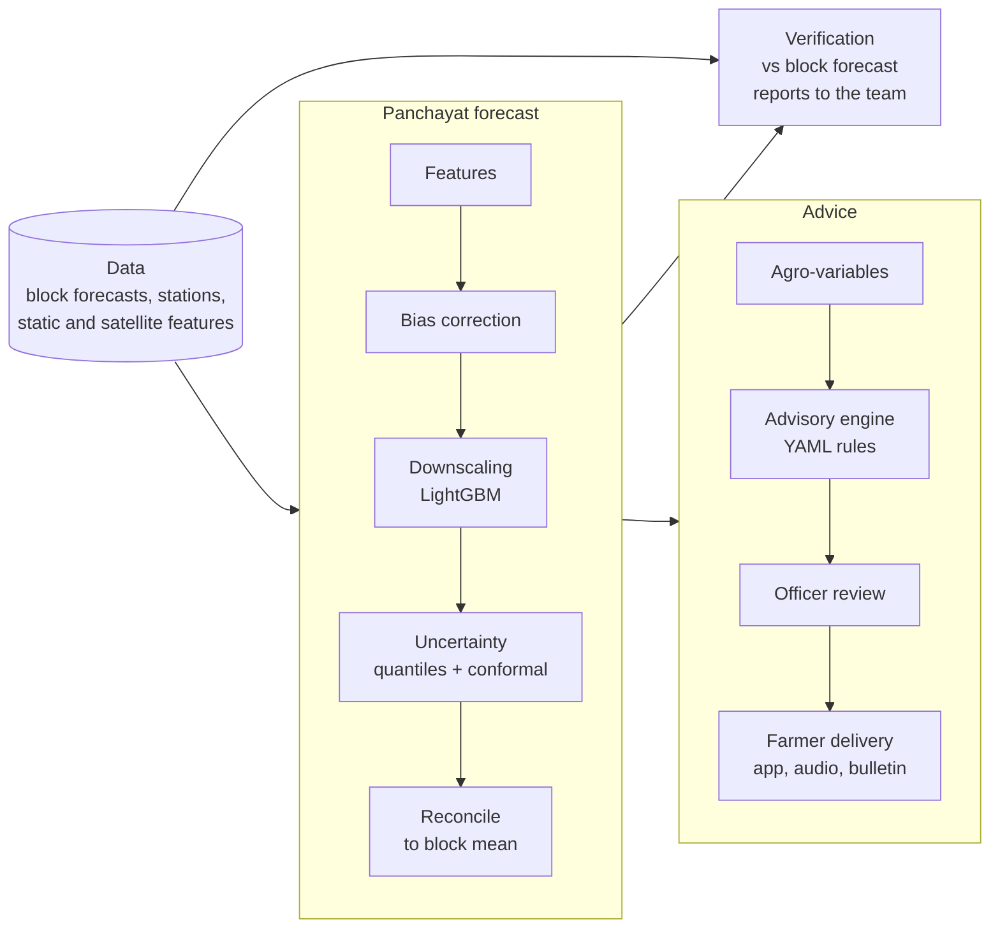
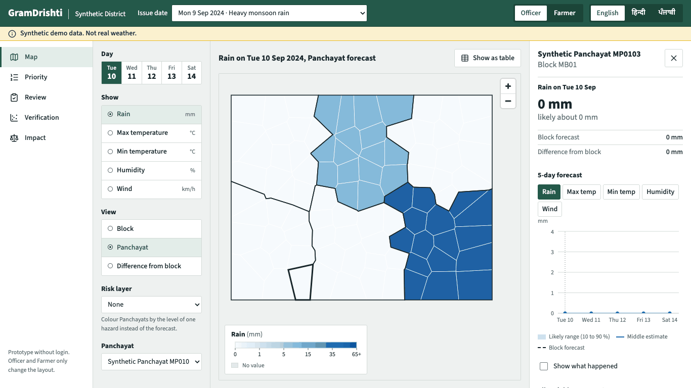
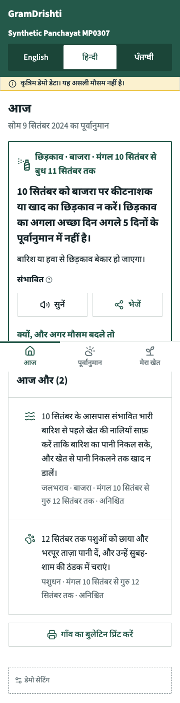
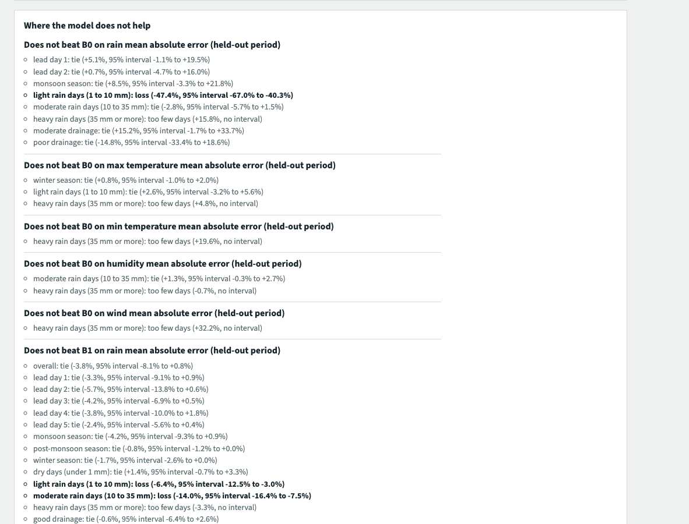
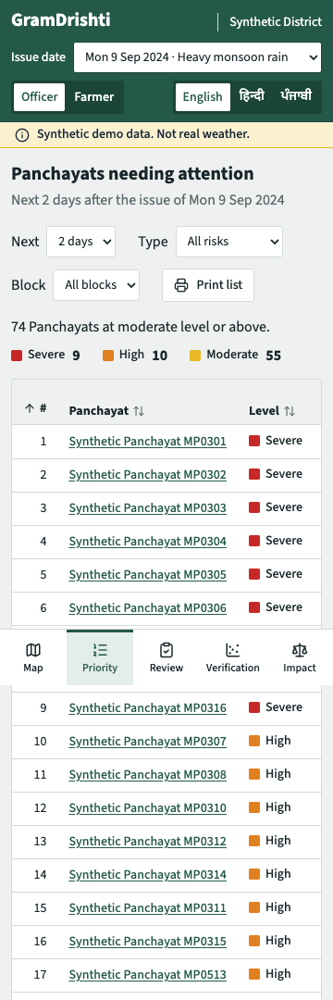

# GramDrishti

Panchayat-level weather forecasts and officer-reviewed crop advisories, built from block-level forecasts.

> **All data in this repository is synthetic.** The district, Panchayats, stations, forecasts, observations and farmer reports in `data/` are artificial. Every accuracy number produced on them shows that the method and code work on data built to resemble the problem, not that the method works on real weather. See [data/README.md](data/README.md) and the [data card](docs/data_card.md).

## The problem

Smart India Hackathon 2026, problem **SIH26074**: downscale block-level weather forecasts to Panchayat level for agro-meteorological advisory services.

Weather forecasts for farmers in India are usually issued per block, an area that can hold dozens of Panchayats. Within one block, rain can fall on one village and miss the next, irrigated land runs cooler than dry land, and low-lying fields get colder on winter nights and flood first. A single block number hides these differences, so advice such as "spray tomorrow" or "delay irrigation" can be wrong for many of the farmers who receive it.

## The solution in one paragraph

GramDrishti corrects the known biases of the block forecast, then uses LightGBM with local features (terrain, land cover, soil, irrigation, satellite greenness and recent rain) to forecast each Panchayat as a likely range, not a single number, and shifts the Panchayat values so they always average back to the block forecast. From these it derives farm conditions (crop water demand, soil water, waterlogging, heat and frost) and drafts crop-stage advice from readable YAML rules, never from a language model. An agriculture officer reviews, edits and approves every advisory; farmers then get it in Hindi, Punjabi or English on a phone app that works offline, with audio and a printable village bulletin. A one-time verification on a held-out period measures whether all this beats the plain block forecast, and shows where it does not.

## Architecture


```mermaid
flowchart LR
    D[("Data<br/>block forecasts, stations,<br/>static and satellite features")]
    subgraph forecast["Panchayat forecast"]
        direction TB
        F[Features] --> BC[Bias correction] --> DS[Downscaling<br/>LightGBM] --> U[Uncertainty<br/>quantiles + conformal] --> R[Reconcile<br/>to block mean]
    end
    subgraph advice["Advice"]
        direction TB
        AV[Agro-variables] --> AE[Advisory engine<br/>YAML rules] --> OR[Officer review] --> FD[Farmer delivery<br/>app, audio, bulletin]
    end
    V[Verification<br/>vs block forecast<br/>reports to the team]
    D --> forecast
    forecast --> advice
    forecast --> V
    D --> V
```

Training, the daily forecast run and verification are offline jobs that write files; the API only reads those files and a SQLite database, so it answers in milliseconds and the whole app can also run from exported files with no server. Verification writes reports for the team; any model or rule change that follows is made and reviewed by people, and a changed model is a new version that must be verified again. Farmer rain reports are stored and can be compared with stations (`verify/feedback_report.py`); nothing retrains from them. Details: [docs/architecture.md](docs/architecture.md).

## Screenshots

All on synthetic data, from the S15 design pass (`docs/screens/after/`).

| | |
|---|---|
|  |  |
| Map explorer: block or Panchayat view, likely range, block forecast and difference | Farmer app in Hindi: only advice an officer approved |
|  |  |
| Verification: losses listed as plainly as wins | Priority list of Panchayats needing attention |

More in the same folder: `readme-map-hindi-desktop.png`, `readme-verification-top.png`, `readme-impact-punjabi-desktop.png`, `readme-farmer-desktop.png`; the "before" versions are in `docs/screens/before/`.

## Quick start

Needs Docker with Compose v2 (Docker Desktop, OrbStack, or Colima: `brew install colima docker docker-compose && colima start --cpu 4 --memory 8`), `make` and `curl`. Nothing else is installed on your machine.

<!-- quickstart:start -->
```bash
git clone https://github.com/joshi-mishita/GramDrishti.git && cd GramDrishti
make up          # build, prepare (trains the model on the first run), start, check
```
<!-- quickstart:end -->

Then open:

| What | Where |
|---|---|
| Officer console and farmer app | http://localhost:8080 |
| Offline copy (snapshot mode, runs without the API) | http://localhost:8081 |
| API and its docs | http://localhost:8000/docs |

The first `make up` takes about 6 to 8 minutes on a laptop (image build about 3.5 minutes, model training about 2 minutes, snapshots and the offline export about 1.5 minutes); later starts take under a minute. Every step and its timing is in [docs/docker.md](docs/docker.md). `make down` stops everything and keeps the model, snapshots and reviews; `make clean` deletes them. `make fresh-check` runs this quick start in a temporary clone and checks the key endpoints ([scripts/fresh_clone_check.sh](scripts/fresh_clone_check.sh)).

A fresh clone trains its own model, and a model trained on another machine gets another version number, so the verification and impact screens say "not computed" until the verification job has run for that version (TEST is opened once per model version, [docs/validation_protocol.md](docs/validation_protocol.md)). On a machine that already has the verified model in `backend/artifacts/`, `make up` uses it and those screens show its numbers. The verified numbers are always readable in [docs/validation_report.md](docs/validation_report.md).

Other commands: `make e2e` (the demo script in Playwright on an isolated stack), `make offline` (refresh the offline copy after approving advisories), `make logs`.

### Without Docker

```bash
cd backend && python -m venv .venv && .venv/bin/pip install -e ".[dev]"
.venv/bin/python -m gramdrishti.pipeline.prepare_demo      # oracle, model, snapshots, farmers
.venv/bin/uvicorn gramdrishti.api.main:app --port 8000
cd frontend && npm ci && npm run dev                          # http://localhost:5173
```

All other commands (tests, verification, contract) are listed in [CLAUDE.md](CLAUDE.md).

## Features mapped to the problem statement

| The problem asks for | What GramDrishti has | Where |
|---|---|---|
| Downscale block forecasts to Panchayat level | Bias-corrected block forecast, LightGBM Panchayat models for rain, maximum and minimum temperature, humidity and wind, lead days 1 to 5 | `backend/gramdrishti/models/`, Map screen |
| Stay consistent with the official forecast | Reconciliation: Panchayat values average back to the block forecast (largest gap 1.4e-14 on the test period; a test enforces 1e-6) | `models/reconcile.py` |
| Say how sure the forecast is | 10th to 90th percentile range with conformal calibration; rain chances for 1, 2.5, 10 and 35 mm | detail panel chart |
| Explain why a Panchayat differs | SHAP reasons in plain English ("Lower ground than the rest of the block, so it is likely wetter") | detail panel |
| Agro-meteorological advisory services | 15 YAML rules across 11 categories, crop-stage aware, with reason, evidence, confidence and fallback; whole-day spray planner | `advisory/rules.yaml`, Review screen |
| Officer in the loop | Priority list, review queue with approve, edit or reject, audit log with before and after | Priority and Review screens |
| Reach farmers | Farmer app in English, Hindi and Punjabi, audio, WhatsApp share text, rain report button, offline use, one-page printable bulletin | `/farmer`, `/bulletin/:pid` |
| Prove the value | One-time verification against the raw and corrected block forecast with bootstrap intervals, three checks, strata, event scores, coverage, decision replay | Verification and Impact screens, [validation report](docs/validation_report.md) |
| Honesty about the data | `data_mode` on every response; ribbon "Synthetic demo data. Not real weather." on every screen | whole app |

## Results so far (synthetic proxy validation)

On the held-out test period (July to December 2024, 73,800 forecasts per variable, synthetic truth), the Panchayat forecast has a lower mean absolute error than the raw block forecast for all five variables. Against the bias-corrected block forecast it is better for maximum temperature (+5.1 %), minimum temperature (+3.8 %), humidity (+4.2 %) and wind (+1.9 %), and **not better for rain** (-3.8 %, a tie). Most of the gain comes from the block bias correction. Full tables, intervals and every place the model does not help: [docs/model_card.md](docs/model_card.md) and [docs/validation_report.md](docs/validation_report.md).

## Tech stack

- **Backend:** Python 3.11+ (3.13 in Docker), FastAPI, Pydantic, pandas, NumPy, PyArrow, LightGBM, scikit-learn, SHAP, joblib, PyYAML, simpleeval, SQLite, gTTS; pytest, httpx, ruff.
- **Frontend:** React 19, TypeScript (strict), Vite, React Router, TanStack Query, Zustand, MapLibre GL JS, Recharts, i18next, lucide-react, openapi-typescript, vite-plugin-pwa; Vitest, Playwright, axe-core. Plain CSS with design tokens; self-hosted Source Sans 3, Noto Sans Devanagari and Noto Sans Gurmukhi.
- **Shared:** OpenAPI contract with generated types, Docker Compose, nginx, GitHub Actions.

## Honest limitations

- **Synthetic data only.** No real data and no data-sharing agreement with any organisation. Real-mode training targets and verification are not built yet ([docs/mock_to_real_plan.md](docs/mock_to_real_plan.md)).
- **Rain is not better than the corrected block forecast**, and worse on light and moderate rain days and in poorly drained Panchayats. Heavy-rain (35 mm) chances are worse than climatology. On the main demo date the rain middle value is the same for every Panchayat in a block.
- **Intervals are uneven:** too narrow for maximum temperature, too wide for humidity and wind, and rain on wet days is covered only about half the time.
- **Thresholds are placeholders.** No agronomist has reviewed the rules or the crop calendar yet ([docs/expert_review_pack.md](docs/expert_review_pack.md)).
- **Hindi and Punjabi texts are drafts** by the team and need a native speaker's review; Panchayat names and some API texts stay in English.
- **Only 8 demo issue dates** are precomputed; the API refuses other dates.
- **No login.** The reviewer name is free text.
- **Not tried on a real phone**, in Firefox or Safari, or with a screen reader; offline was tested in desktop Chrome. Nobody has listened to the Hindi or Punjabi audio.
- **CI has not been seen running** from the build sessions (no `gh` on the build machine).

Known issues in full: [docs/PROGRESS.md](docs/PROGRESS.md).

## Roadmap

1. Expert review of thresholds and the crop calendar; native review of Hindi and Punjabi.
2. Real station data, then real block forecasts, validated leave-one-station-out ([plan](docs/mock_to_real_plan.md)).
3. A soil-moisture source for the water balance.
4. Decide how to serve rain (for example corrected block amounts with the model's rain chances); that is a new model version, reported with "test reused".
5. Costs of a washed-off spray, a wasted wait and a missed heat alert from an expert, so the impact screen can weigh them.
6. Officer accounts, and a field test on a low-end Android phone.
7. Later, only if adopted: PostgreSQL with PostGIS, a scheduler, a model registry ([architecture](docs/architecture.md#production-path-future-not-built)).

## Documents

| For | Read |
|---|---|
| Jury and reviewers | [model card](docs/model_card.md), [data card](docs/data_card.md), [validation report](docs/validation_report.md), [likely questions](docs/qna.md) |
| Running the demo | [demo script](docs/demo_script.md), [Docker guide](docs/docker.md), [presentation outline](docs/presentation_outline.md) |
| Engineers | [architecture](docs/architecture.md), [mock to real plan](docs/mock_to_real_plan.md), [validation protocol](docs/validation_protocol.md), [contract changelog](contract/CHANGELOG.md), [decisions](docs/DECISIONS.md), [progress log](docs/PROGRESS.md) |
| Experts and translators | [expert review pack](docs/expert_review_pack.md), [thresholds table](docs/thresholds_for_expert_review.md), [translation notes](docs/translation_notes.md) |
| Design | [design review](docs/design_review.md), [design tokens](docs/design.md) |

## Status

| Area | Status |
|---|---|
| Data layer, baselines, contract, API | done (S1, S2, S6) |
| Downscaling model, uncertainty, reconciliation | done (S5) |
| Advisory engine, officer review, priority | done (S8, S9) |
| Verification and impact | done (S10, S11) |
| Farmer backend and app, bulletin, offline | done (S12, S13) |
| Docker, one-command start, end-to-end tests | done (S14) |
| Design and accessibility pass | done (S15) |
| Documentation and submission assets | this branch (S16) |

Sessions S13 to S16 are on branches not yet merged into `main`. Full log: [docs/PROGRESS.md](docs/PROGRESS.md).

## Contributing

See [CONTRIBUTING.md](CONTRIBUTING.md). Project rules for Claude Code sessions are in [CLAUDE.md](CLAUDE.md).

## Licence

[MIT](LICENSE). Fonts under the SIL Open Font License ([docs/licences/fonts/](docs/licences/fonts/)).
