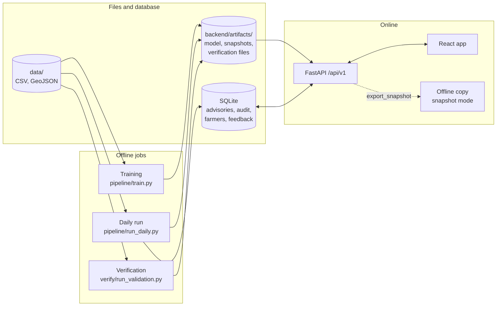
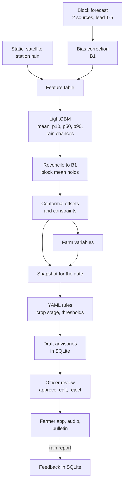

# Architecture

This describes the prototype as built (sessions S0 to S15) and, at the end, a production path that is **future work, not built**. Everything runs on synthetic data today.

## Components

| Component | Code | What it does |
|---|---|---|
| Data layer | `backend/gramdrishti/data/` | one loader per file, the same columns in mock and real mode; QC flags (range, consistency, spikes, stuck sensors, missing days); time windows and the TEST guard |
| Features | `features/` | one feature table for training and inference (55 columns) |
| Models | `models/` | bias correction (B1), baselines B0 and B2, LightGBM mean and quantile models, rain event classifiers with isotonic calibration, reconciliation, conformal offsets |
| Farm variables | `agro/derived.py` | ET0, soil water bucket, waterlogging, THI, frost, fog proxy, dry spell, growing degree days |
| Explanations | `explain/` | SHAP contrasts with the block, 25 groups, English sentences |
| Advisory engine | `advisory/` | signals, YAML rules (`rules.yaml`), templates in en/hi/pa (`templates.yaml`), day-level spray planner, risk scores, priority, de-duplication, audio (gTTS) |
| Store | `store/` | SQLite with migrations: advisories, audit log, farmers, feedback, generation runs |
| Verification | `verify/` | metrics, the one-time TEST job, TEST ledger, decision replay, report generator, feedback report |
| API | `api/` | 24 endpoints under `/api/v1`, Pydantic schemas, contract error shape, body size limit, CORS from config, JSON access log |
| Frontend | `frontend/src/` | React 19, TypeScript, Vite, TanStack Query, Zustand, MapLibre GL, Recharts, i18next; plain CSS with tokens; PWA service worker |
| Docker | `docker-compose.yml`, `Makefile`, `scripts/demo.sh` | `prepare` (one-shot), `api` (8000), `web` (8080), `web-offline` (8081) |

## Data flow for one issue date

- Training reads TRAIN and CALIB only. The daily run applies the saved bundle to one issue date, checks block consistency (below 1e-6) and writes the snapshot plus draft advisories. A rebuild is byte-identical (each snapshot manifest carries sha256 per file).
- Drafts are made at "08:00" of the issue date in the audit log (DECISIONS D063). Only `approved` and `edited` advisories reach `/farmers/{id}/advice`.
- Feedback is stored and can be compared with stations in a report (`verify/feedback_report.py`); nothing retrains from it.

## Snapshot design

The guide's rule: anything that runs at request time only reads precomputed files or the database.

- `run_daily --all-demo-dates` writes 16 snapshots: the 8 demo issue dates and the day before each (for "forecast changed since yesterday"). About 4.5 MB and 34 s (S6).
- The forecast endpoints accept only these demo dates; any other date answers 404 (DECISIONS D016). The dates were chosen from issued forecasts only, not from outcomes (`contract/pick_demo_dates.py`).
- A missing snapshot or verification file answers 503 `not_computed`; the API never computes or changes a score.
- Measured on the dev laptop (S6, S8): median warm latency 3.2 to 6.2 ms for the forecast endpoints, 70 ms for `/priority`; the first risk or priority request per date takes 0.45 to 0.7 s while the engine runs, then it is cached.
- **Offline copy:** `export_snapshot` saves every GET response the frontend sends for the demo dates (21,965 files, 39 MB) with an `index.json`. The app built with `VITE_SNAPSHOT=1` reads these files and makes no API call. Docker serves it on port 8081 as demo insurance.
- **Farmer phone offline:** the PWA service worker precaches the app shell and fonts and serves data network first with a cache fallback. A screen never opened online is not available offline.

## The contract

- Appendix A of both guides defines every JSON shape. It is implemented as `contract/openapi.json` (exported from FastAPI) and `contract/examples/*.json` (85 files made by calling the app, each validated against its model).
- Version history in `contract/CHANGELOG.md`: v0.1.1 frozen on 2026-09-25, then additive, optional fields only up to **v0.4.0**. No breaking change has been made.
- The frontend types are generated from `openapi.json` (`npm run gen:types`); CI fails if they drift. Hand-written response types are not allowed.
- The frontend can switch endpoint groups between example files and the real API (`VITE_REAL_ENDPOINTS`), which is how both halves were built in parallel.
- Every response carries `data_mode` (`mock` or `real`). The UI shows the ribbon "Synthetic demo data. Not real weather." when it is `mock`. Responses never contain NaN or Infinity (null instead), GeoJSON is [longitude, latitude], dates are `YYYY-MM-DD`.

## Tests and checks

| What | Where | Count (last run) |
|---|---|---|
| Backend unit and API tests | `backend/tests/`, `pytest -q` | 433 passed (S16, after merging S13 and S14) |
| Frontend unit tests | `frontend/src/**/*.test.ts(x)`, `npm run test` | 233 passed (S16) |
| Review flow on a real API | `npm run e2e` | 19 passed (S15) |
| Farmer journey at 360 px, offline reload, bulletin print | `npm run e2e:farmer` | 5 passed (S15) |
| Accessibility (axe, 14 screens x 3 languages x 2 widths, keyboard walk) | `npm run a11y` | 0 violations after S15 |
| Demo script on the Docker stack | `make e2e` | S14 run: step 5b skipped, see known issues |
| README quick start in a temp clone | `make fresh-check` | see PROGRESS S16 |

CI (GitHub Actions, `.github/workflows/ci.yml`): backend (ruff, pytest), frontend (lint, test, build, type drift), contract (openapi, examples, types), Docker stack with the demo e2e. CI has not been seen running from these sessions because `gh` is not installed here.

## Production path (future, not built)

Nothing in this section exists. It is the order we would change things in if the prototype were adopted, with the reason for each.

| Today (prototype) | Future | Why | Trigger |
|---|---|---|---|
| SQLite file | PostgreSQL with PostGIS | several officers writing at once, spatial queries on real boundaries, backups | more than one district or concurrent reviewers |
| Scripts run by hand or by `make up` | a scheduler such as Airflow (daily run, verification, exports as tasks) | daily forecasts arrive on a schedule; retries and alerts on failure | real forecasts arriving daily |
| joblib bundle in `backend/artifacts/` with a data hash | a model registry such as MLflow (version, data hash, verification record together) | several model versions and a record of which was verified on which window | first retrain on real data |
| Docker Compose on one laptop | Kubernetes or a managed container service | more than one machine, rolling updates | a pilot with real users |
| JSON files served by the API | the same files in object storage behind a CDN | the files are already static | many farmers reading at once |
| No login; reviewer name is free text | officer accounts with roles; audit log tied to the account | accountability of approvals | before any real advice is sent |
| gTTS for audio (a library that calls Google Translate's speech service over the internet) | a speech service agreed with the state, or recorded audio | reliability, pronunciation review, no dependency on a service we have no agreement with | before real use |

The API contract, the snapshot design and the review step would stay the same.
